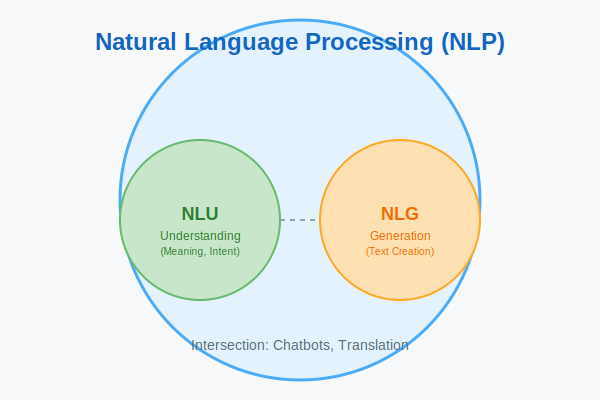

# NLP vs. NLU vs. NLG

In the world of Artificial Intelligence, the terms **NLP**, **NLU**, and **NLG** are often used interchangeably, but they refer to distinct concepts. Understanding the differences between them is crucial for anyone working in the field.

## 1. Natural Language Processing (NLP)

**NLP** is the overarching field that encompasses the entire spectrum of enabling computers to understand, interpret, and manipulate human language. It deals with the processing and analysis of human language data.

*   **Goal:** To bridge the gap between human communication and computer understanding.
*   **Scope:** Covers both NLU and NLG.
*   **Examples:** Machine translation, sentiment analysis, spam filtering.

## 2. Natural Language Understanding (NLU)

**NLU** is a subset of NLP that focuses on enabling machines to **comprehend the meaning and intent** behind human language. It involves tasks like understanding grammar, context, and the objective of a text to extract relevant information.

*   **Goal:** To determine "what does this text mean?"
*   **Key Tasks:**
    *   **Intent Classification:** Identifying the user's goal (e.g., "Book a flight").
    *   **Entity Extraction:** Identifying specific pieces of information (e.g., "London", "tomorrow").
    *   **Sentiment Analysis:** Determining the emotional tone.
*   **Analogy:** NLU is like "reading comprehension" for computers.

## 3. Natural Language Generation (NLG)

**NLG** is a subset of NLP that focuses on **producing human-like text** from structured data. It allows machines to create narratives, reports, summaries, or conversational responses that are coherent and contextually relevant.

*   **Goal:** To translate structured data into natural language.
*   **Key Tasks:**
    *   **Text Summarization:** Creating a short summary of a long document.
    *   **Chatbot Responses:** Generating a natural reply to a user's query.
    *   **Automated Reporting:** Turning a spreadsheet of data into a written report.
*   **Analogy:** NLG is like "writing" for computers.

## The Relationship

You can visualize the relationship as follows:

$$ 
\text{NLP} = \text{NLU} + \text{NLG} + \text{Other Processing Tasks} 
$$

1.  **Input:** User speaks or types text.
2.  **NLU:** The computer understands what was said.
3.  **Processing:** The computer performs the necessary logic/actions.
4.  **NLG:** The computer constructs a response in natural language.
5.  **Output:** The computer speaks or displays the text.
