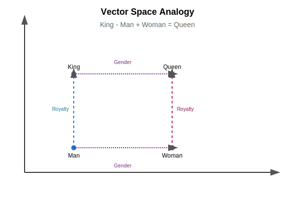

# Word Embeddings

Word embeddings are a type of word representation that allows words with similar meanings to have a similar representation. They are a way of representing words as vectors of real numbers.

Word embeddings are a key breakthrough in deep learning for NLP. They have been shown to be very effective for a variety of NLP tasks, such as machine translation, sentiment analysis, and question answering.

## Why Word Embeddings?



Traditional word representations, such as one-hot encoding, are very sparse and do not capture the semantic meaning of words. Word embeddings, on the other hand, are dense and are able to capture the semantic meaning of words and their relationships to other words.

## Popular Word Embedding Models

There are a number of popular word embedding models, including:

*   **Word2Vec:** This model was developed by Google in 2013. It is a neural network-based model that learns to embed words in a low-dimensional vector space.
*   **GloVe:** This model was developed by Stanford in 2014. It is a count-based model that learns to embed words in a low-dimensional vector space.
*   **FastText:** This model was developed by Facebook in 2016. It is an extension of the Word2Vec model that is able to learn embeddings for out-of-vocabulary words.

## Python Example

This example shows how to use the Gensim library to train a Word2Vec model on a piece of text.

```python
from gensim.models import Word2Vec
from nltk.tokenize import word_tokenize

# Sample corpus
corpus = "this is a sentence this is another sentence"
tokenized_corpus = [word_tokenize(sentence) for sentence in corpus.split('\n')]

# Train a Word2Vec model
model = Word2Vec(tokenized_corpus, min_count=1)

# Get the vector for a word
vector = model.wv['sentence']
print("Vector for 'sentence':", vector)

# Find the most similar words to a word
similar_words = model.wv.most_similar('sentence')
print("Words similar to 'sentence':", similar_words)
```

### Mathematical Foundation

The Word2Vec model is a neural network with a single hidden layer. The input to the model is a one-hot encoded vector of the a word, and the output is a vector of probabilities for each word in the vocabulary. The model is trained to predict the context words of a given word.

There are two main architectures for the Word2Vec model:

*   **Continuous Bag-of-Words (CBOW):** This architecture predicts the current word based on the context words.
*   **Skip-gram:** This architecture predicts the context words based on the current word.

#### Skip-gram

The objective of the skip-gram model is to maximize the probability of the context words given the current word.

The probability of a context word $w_O$ given the current word $w_I$ is defined as:

$$
P(w_O|w_I) = \frac{\exp({v'_{w_O}}^T v_{w_I})}{\sum_{w=1}^{V} \exp({v'_w}^T v_{w_I})}
$$

where:

*   $v_{w_I}$ is the input vector of the current word
*   $v'_{w_O}$ is the output vector of the context word
*   $V$ is the size of the vocabulary

The loss function for the skip-gram model is the negative log likelihood of the context words:

$$
L = -\sum_{c=1}^{C} \log P(w_{I,c}|w_I)
$$

where $C$ is the size of the context window.

The skip-gram architecture is slower to train than the CBOW architecture, but it often results in better performance.

```