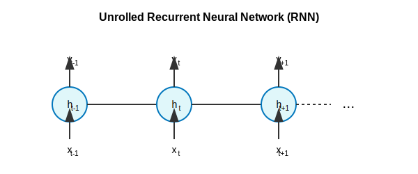

# Recurrent Neural Networks (RNNs)

Recurrent Neural Networks (RNNs) are a type of neural network that is designed to work with sequential data, such as text. RNNs have a "memory" that allows them to remember information from previous time steps.

## How RNNs Work



An RNN works by taking an input at each time step and producing an output. The output at each time step is a function of the input at that time step and the hidden state of the RNN at the previous time step.

The hidden state of the RNN is a vector of numbers that represents the memory of the RNN. The hidden state is updated at each time step, and it is used to predict the output at the next time step.

### Mathematical Derivation

The hidden state $h_t$ and output $y_t$ of an RNN at time step $t$ are calculated as follows:

$$
h_t = \tanh(W_{hh}h_{t-1} + W_{xh}x_t + b_h)
$$

$$
y_t = W_{hy}h_t + b_y
$$

where:

*   $x_t$ is the input at time step $t$
*   $h_{t-1}$ is the hidden state at the previous time step
*   $W_{hh}$, $W_{xh}$, and $W_{hy}$ are weight matrices
*   $b_h$ and $b_y$ are bias vectors
*   $\tanh$ is the hyperbolic tangent activation function

### Backpropagation Through Time (BPTT)

RNNs are trained using the backpropagation through time (BPTT) algorithm. BPTT is a variation of the backpropagation algorithm that is used to train RNNs.

The BPTT algorithm works by unrolling the RNN in time and then applying the standard backpropagation algorithm. The error at each time step is propagated back to the previous time steps.

The gradients of the loss function $L$ with respect to the weight matrices are calculated as follows:

$$
\frac{\partial L}{\partial W_{hy}} = \sum_{t=1}^{T} \frac{\partial L_t}{\partial y_t} \frac{\partial y_t}{\partial W_{hy}}
$$

$$
\frac{\partial L}{\partial W_{hh}} = \sum_{t=1}^{T} \frac{\partial L_t}{\partial y_t} \frac{\partial y_t}{\partial h_t} (\sum_{k=1}^{t} \frac{\partial h_t}{\partial h_k} \frac{\partial h_k}{\partial W_{hh}})
$$

$$
\frac{\partial L}{\partial W_{xh}} = \sum_{t=1}^{T} \frac{\partial L_t}{\partial y_t} \frac{\partial y_t}{\partial h_t} (\sum_{k=1}^{t} \frac{\partial h_t}{\partial h_k} \frac{\partial h_k}{\partial W_{xh}})
$$

## Python Example

Below are implementations of a simple RNN for text classification using both **TensorFlow/Keras** and **PyTorch**.

### Option 1: TensorFlow/Keras Implementation

```python
from keras.models import Sequential
from keras.layers import Embedding, SimpleRNN, Dense
from keras.preprocessing.text import Tokenizer
from keras.preprocessing.sequence import pad_sequences
import numpy as np

# Sample data
texts = ["this is a positive review", "this is a negative review", "i am happy", "i am sad"]
labels = np.array([1, 0, 1, 0])

# Tokenize the text
tokenizer = Tokenizer()
tokenizer.fit_on_texts(texts)
sequences = tokenizer.texts_to_sequences(texts)

# Pad the sequences
max_len = max([len(s) for s in sequences])
padded_sequences = pad_sequences(sequences, maxlen=max_len)

# Build the model
model = Sequential()
model.add(Embedding(len(tokenizer.word_index) + 1, 128, input_length=max_len))
model.add(SimpleRNN(64))
model.add(Dense(1, activation='sigmoid'))

# Compile the model
model.compile(optimizer='adam', loss='binary_crossentropy', metrics=['accuracy'])

# Train the model
model.fit(padded_sequences, labels, epochs=10)

# Evaluate the model
loss, accuracy = model.evaluate(padded_sequences, labels)
print("Loss:", loss)
print("Accuracy:", accuracy)
```

### Option 2: PyTorch Implementation

```python
import torch
import torch.nn as nn
import torch.optim as optim
from torch.utils.data import DataLoader, TensorDataset
import numpy as np

# Sample data
texts = ["this is a positive review", "this is a negative review", "i am happy", "i am sad"]
labels = np.array([1, 0, 1, 0])

# Preprocessing (Manual Tokenization for PyTorch example)
word2idx = {}
for text in texts:
    for word in text.split():
        if word not in word2idx:
            word2idx[word] = len(word2idx) + 1 # Index 0 is reserved for padding

sequences = []
for text in texts:
    sequences.append([word2idx[word] for word in text.split()])

# Pad sequences
max_len = max([len(s) for s in sequences])
padded_sequences = np.zeros((len(sequences), max_len), dtype=int)
for i, seq in enumerate(sequences):
    padded_sequences[i, :len(seq)] = seq

# Convert to Tensors
X_train = torch.tensor(padded_sequences, dtype=torch.long)
y_train = torch.tensor(labels, dtype=torch.float32).unsqueeze(1)

# Dataset and DataLoader
dataset = TensorDataset(X_train, y_train)
dataloader = DataLoader(dataset, batch_size=2, shuffle=True)

# Build the Model
class SimpleRNN(nn.Module):
    def __init__(self, vocab_size, embedding_dim, hidden_dim):
        super(SimpleRNN, self).__init__()
        self.embedding = nn.Embedding(vocab_size, embedding_dim)
        self.rnn = nn.RNN(embedding_dim, hidden_dim, batch_first=True)
        self.fc = nn.Linear(hidden_dim, 1)
        self.sigmoid = nn.Sigmoid()

    def forward(self, x):
        embedded = self.embedding(x)
        output, hidden = self.rnn(embedded)
        # Use the hidden state from the last time step
        last_hidden = hidden[-1] 
        return self.sigmoid(self.fc(last_hidden))

# Initialize Model
vocab_size = len(word2idx) + 1
embedding_dim = 128
hidden_dim = 64
model = SimpleRNN(vocab_size, embedding_dim, hidden_dim)

# Loss and Optimizer
criterion = nn.BCELoss()
optimizer = optim.Adam(model.parameters(), lr=0.001)

# Training Loop
for epoch in range(10):
    for inputs, targets in dataloader:
        optimizer.zero_grad()
        outputs = model(inputs)
        loss = criterion(outputs, targets)
        loss.backward()
        optimizer.step()
    
    if (epoch+1) % 2 == 0:
        print(f'Epoch [{epoch+1}/10], Loss: {loss.item():.4f}')

# Evaluation (Simple check)
with torch.no_grad():
    test_out = model(X_train)
    predicted = (test_out > 0.5).float()
    accuracy = (predicted == y_train).sum() / y_train.shape[0]
    print(f"Accuracy: {accuracy.item():.4f}")
```

## Vanishing Gradient Problem

One of the main challenges with RNNs is the vanishing gradient problem. This is a problem that occurs when the gradients of the loss function with respect to the weights of the network become very small. This can make it difficult for the network to learn long-term dependencies.

The vanishing gradient problem is addressed by more advanced RNN architectures, such as LSTMs and GRUs.

```