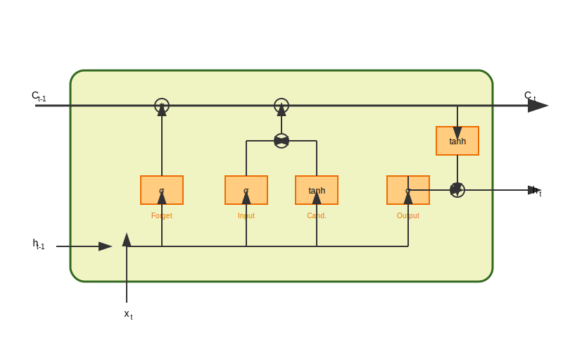

# Long Short-Term Memory (LSTM)

Long Short-Term Memory (LSTM) is a type of recurrent neural network (RNN) that is able to learn long-term dependencies. LSTMs were introduced in 1997 by Sepp Hochreiter and Jürgen Schmidhuber.

## How LSTMs Work



LSTMs are similar to RNNs, but they have a more complex internal structure. The key component of an LSTM is the memory cell, which is a vector of numbers that represents the memory of the LSTM.

The memory cell is updated at each time step by a set of gates. The gates are neural networks that control the flow of information into and out of the memory cell.

There are three types of gates in an LSTM:

*   **Input gate:** This gate controls the flow of information into the memory cell.
*   **Forget gate:** This gate controls the flow of information out of the memory cell.
*   **Output gate:** This gate controls the output of the LSTM.

### Mathematical Derivation

The gates and cell state of an LSTM at time step $t$ are calculated as follows:

$$ i_t = \sigma(W_{ii}x_t + b_{ii} + W_{hi}h_{t-1} + b_{hi}) $$

$$ f_t = \sigma(W_{if}x_t + b_{if} + W_{hf}h_{t-1} + b_{hf}) $$

$$ g_t = \tanh(W_{ig}x_t + b_{ig} + W_{hg}h_{t-1} + b_{hg}) $$

$$ o_t = \sigma(W_{io}x_t + b_{io} + W_{ho}h_{t-1} + b_{ho}) $$

$$ c_t = f_t \odot c_{t-1} + i_t \odot g_t $$

$$ h_t = o_t \odot \tanh(c_t) $$

where:

*   $x_t$ is the input at time step $t$
*   $h_{t-1}$ is the hidden state at the previous time step
*   $c_{t-1}$ is the cell state at the previous time step
*   $W$ and $b$ are weight matrices and bias vectors
*   $\sigma$ is the sigmoid activation function
*   $\tanh$ is the hyperbolic tangent activation function
*   $\odot$ is the element-wise product

## Python Example

Below are implementations of a simple LSTM for text classification using both **TensorFlow/Keras** and **PyTorch**.

### Option 1: TensorFlow/Keras Implementation

```python
from keras.models import Sequential
from keras.layers import Embedding, LSTM, Dense
from keras.preprocessing.text import Tokenizer
from keras.preprocessing.sequence import pad_sequences
import numpy as np

# Sample data
texts = ["this is a positive review", "this is a negative review", "i am happy", "i am sad"]
labels = np.array([1, 0, 1, 0])

# Tokenize the text
tokenizer = Tokenizer()
tokenizer.fit_on_texts(texts)
sequences = tokenizer.texts_to_sequences(texts)

# Pad the sequences
max_len = max([len(s) for s in sequences])
padded_sequences = pad_sequences(sequences, maxlen=max_len)

# Build the model
model = Sequential()
model.add(Embedding(len(tokenizer.word_index) + 1, 128, input_length=max_len))
model.add(LSTM(64))
model.add(Dense(1, activation='sigmoid'))

# Compile the model
model.compile(optimizer='adam', loss='binary_crossentropy', metrics=['accuracy'])

# Train the model
model.fit(padded_sequences, labels, epochs=10)

# Evaluate the model
loss, accuracy = model.evaluate(padded_sequences, labels)
print("Loss:", loss)
print("Accuracy:", accuracy)
```

### Option 2: PyTorch Implementation

```python
import torch
import torch.nn as nn
import torch.optim as optim
from torch.utils.data import DataLoader, TensorDataset
import numpy as np

# Sample data
texts = ["this is a positive review", "this is a negative review", "i am happy", "i am sad"]
labels = np.array([1, 0, 1, 0])

# Preprocessing (Manual Tokenization for PyTorch example)
word2idx = {}
for text in texts:
    for word in text.split():
        if word not in word2idx:
            word2idx[word] = len(word2idx) + 1 

sequences = []
for text in texts:
    sequences.append([word2idx[word] for word in text.split()])

# Pad sequences
max_len = max([len(s) for s in sequences])
padded_sequences = np.zeros((len(sequences), max_len), dtype=int)
for i, seq in enumerate(sequences):
    padded_sequences[i, :len(seq)] = seq

# Convert to Tensors
X_train = torch.tensor(padded_sequences, dtype=torch.long)
y_train = torch.tensor(labels, dtype=torch.float32).unsqueeze(1)

# Dataset and DataLoader
dataset = TensorDataset(X_train, y_train)
dataloader = DataLoader(dataset, batch_size=2, shuffle=True)

# Build the Model
class LSTMClassifier(nn.Module):
    def __init__(self, vocab_size, embedding_dim, hidden_dim):
        super(LSTMClassifier, self).__init__()
        self.embedding = nn.Embedding(vocab_size, embedding_dim)
        self.lstm = nn.LSTM(embedding_dim, hidden_dim, batch_first=True)
        self.fc = nn.Linear(hidden_dim, 1)
        self.sigmoid = nn.Sigmoid()

    def forward(self, x):
        embedded = self.embedding(x)
        # LSTM output: (batch, seq_len, hidden_dim)
        # hidden state: (num_layers, batch, hidden_dim)
        # cell state: (num_layers, batch, hidden_dim)
        output, (hidden, cell) = self.lstm(embedded)
        
        # Use the final hidden state
        last_hidden = hidden[-1]
        return self.sigmoid(self.fc(last_hidden))

# Initialize Model
vocab_size = len(word2idx) + 1
embedding_dim = 128
hidden_dim = 64
model = LSTMClassifier(vocab_size, embedding_dim, hidden_dim)

# Loss and Optimizer
criterion = nn.BCELoss()
optimizer = optim.Adam(model.parameters(), lr=0.001)

# Training Loop
for epoch in range(10):
    for inputs, targets in dataloader:
        optimizer.zero_grad()
        outputs = model(inputs)
        loss = criterion(outputs, targets)
        loss.backward()
        optimizer.step()
    
    if (epoch+1) % 2 == 0:
        print(f'Epoch [{epoch+1}/10], Loss: {loss.item():.4f}')

# Evaluation
with torch.no_grad():
    test_out = model(X_train)
    predicted = (test_out > 0.5).float()
    accuracy = (predicted == y_train).sum() / y_train.shape[0]
    print(f"Accuracy: {accuracy.item():.4f}")
```
