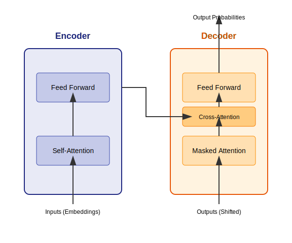

# Transformers

Transformers are a type of neural network that was introduced in 2017 in the paper "Attention Is All You Need". They have been shown to be very effective for a variety of NLP tasks, and they are now the state-of-the-art for many tasks.

## How Transformers Work

Transformers are different from RNNs in that they do not have a recurrent structure. Instead, they use a mechanism called "attention" to learn the relationships between words in a sequence.

The attention mechanism allows the transformer to weigh the importance of different words in a sequence when it is making a prediction. This allows the transformer to learn long-term dependencies without having to use a recurrent structure.

### Key Concepts



*   **Self-Attention:** This is the key mechanism in the transformer. It allows the model to weigh the importance of different words in a sequence when it is making a prediction.
*   **Multi-Head Attention:** This is a variation of self-attention that allows the model to attend to different parts of the sequence at the same time.
*   **Positional Encodings:** Since transformers do not have a recurrent structure, they need a way to encode the position of each word in the sequence. This is done using positional encodings.

### Mathematical Derivation

The self-attention mechanism is based on the following formula:

$$
\text{Attention}(Q, K, V) = \text{softmax}(\frac{QK^T}{\sqrt{d_k}})V
$$

where:

*   $Q$ is the query matrix
*   $K$ is the key matrix
*   $V$ is the value matrix
*   $d_k$ is the dimension of the key matrix

### Solved Example: Self-Attention Calculation

Let's calculate self-attention for a simplified input sequence of two words: "Hello World".
Assume the input embedding dimension is 3, and the output dimension for Q, K, V is 2.

**1. Input Embeddings (X):**
Let embeddings for "Hello" be $[1, 0, 1]$ and "World" be $[0, 1, 1]$.
$$
X = \begin{bmatrix} 1 & 0 & 1 \\ 0 & 1 & 1 \end{bmatrix}
$$

**2. Weight Matrices ($W^Q, W^K, W^V$):**
Let's assume the learned weight matrices are:
$$
W^Q = \begin{bmatrix} 0.5 & 0.0 \\ 0.0 & 0.5 \\ 0.5 & 0.0 \end{bmatrix},
W^K = \begin{bmatrix} 0.0 & 0.5 \\ 0.5 & 0.0 \\ 0.0 & 0.5 \end{bmatrix},
W^V = \begin{bmatrix} 0.5 & 0.5 \\ 0.0 & 0.0 \\ 0.5 & 0.5 \end{bmatrix}
$$

**3. Calculate Q, K, V Matrices:**
*   $Q = X \cdot W^Q = \begin{bmatrix} 1.0 & 0.0 \\ 0.5 & 0.5 \end{bmatrix}$
*   $K = X \cdot W^K = \begin{bmatrix} 0.0 & 1.0 \\ 0.5 & 0.5 \end{bmatrix}$
*   $V = X \cdot W^V = \begin{bmatrix} 1.0 & 1.0 \\ 0.5 & 0.5 \end{bmatrix}$

**4. Calculate Attention Scores ($Q \cdot K^T$):**
$$
K^T = \begin{bmatrix} 0.0 & 0.5 \\ 1.0 & 0.5 \end{bmatrix}
$$
$$
\text{Scores} = Q \cdot K^T = \begin{bmatrix} 1.0 & 0.0 \\ 0.5 & 0.5 \end{bmatrix} \cdot \begin{bmatrix} 0.0 & 0.5 \\ 1.0 & 0.5 \end{bmatrix} = \begin{bmatrix} 0.0 & 0.5 \\ 0.5 & 0.5 \end{bmatrix}
$$

**5. Scale and Softmax:**
Divide by $\sqrt{d_k} = \sqrt{2} \approx 1.414$.
$$
\text{Scaled Scores} = \begin{bmatrix} 0.0 & 0.35 \\ 0.35 & 0.35 \end{bmatrix}
$$
Apply Softmax row-wise:
*   Row 1 ($e^0, e^{0.35}$) $\rightarrow$ $[0.41, 0.59]$
*   Row 2 ($e^{0.35}, e^{0.35}$) $\rightarrow$ $[0.5, 0.5]$

$$
\text{Attention Weights} (A) = \begin{bmatrix} 0.41 & 0.59 \\ 0.5 & 0.5 \end{bmatrix}
$$

**6. Calculate Output ($A \cdot V$):**
$$
\text{Output} = \begin{bmatrix} 0.41 & 0.59 \\ 0.5 & 0.5 \end{bmatrix} \cdot \begin{bmatrix} 1.0 & 1.0 \\ 0.5 & 0.5 \end{bmatrix}
$$
$$
\text{Output} = \begin{bmatrix} 0.41(1)+0.59(0.5) & 0.41(1)+0.59(0.5) \\ 0.5(1)+0.5(0.5) & 0.5(1)+0.5(0.5) \end{bmatrix} = \begin{bmatrix} 0.705 & 0.705 \\ 0.75 & 0.75 \end{bmatrix}
$$

This output matrix represents the contextualized embeddings for "Hello" and "World".

## Python Example

Below are implementations showing how to use the Hugging Face Transformers library. We show the high-level `pipeline` API, and then specific examples for loading models in **TensorFlow** and **PyTorch**.

### Option 1: High-Level Pipeline (Framework Agnostic)

The `pipeline` function automatically selects the framework installed in your environment.

```python
from transformers import pipeline

# Load the text classification pipeline
classifier = pipeline("sentiment-analysis")

# Classify a piece of text
result = classifier("This is a great product. I am very happy with it.")

print(result)
```

### Option 2: TensorFlow/Keras Specific Loading

If you want to explicitly work with TensorFlow tensors and models:

```python
from transformers import TFAutoModelForSequenceClassification, AutoTokenizer
import tensorflow as tf

model_name = "distilbert-base-uncased-finetuned-sst-2-english"

# Load Tokenizer
tokenizer = AutoTokenizer.from_pretrained(model_name)

# Load Model (TensorFlow version)
model = TFAutoModelForSequenceClassification.from_pretrained(model_name)

# Prepare Input
inputs = tokenizer("This is a great product.", return_tensors="tf")

# Inference
outputs = model(inputs)
logits = outputs.logits
predicted_class_id = tf.argmax(logits, axis=-1).numpy()[0]

print(f"Predicted Class ID: {predicted_class_id}")
```

### Option 3: PyTorch Specific Loading

If you want to explicitly work with PyTorch tensors and models:

```python
from transformers import AutoModelForSequenceClassification, AutoTokenizer
import torch

model_name = "distilbert-base-uncased-finetuned-sst-2-english"

# Load Tokenizer
tokenizer = AutoTokenizer.from_pretrained(model_name)

# Load Model (PyTorch version)
model = AutoModelForSequenceClassification.from_pretrained(model_name)

# Prepare Input
inputs = tokenizer("This is a great product.", return_tensors="pt")

# Inference
with torch.no_grad():
    outputs = model(**inputs)
    logits = outputs.logits
    predicted_class_id = torch.argmax(logits, dim=-1).item()

print(f"Predicted Class ID: {predicted_class_id}")
```

**Output:**
```
[{'label': 'POSITIVE', 'score': 0.9998799562454224}]
```

## BERT, GPT, and other Transformer-based models

Since the introduction of the transformer, a number of other transformer-based models have been developed. Some of the most popular models include:

*   **BERT (Bidirectional Encoder Representations from Transformers):** This model was developed by Google in 2018. It is a bidirectional model that is able to learn the context of a word from both the left and the right.
*   **GPT (Generative Pre-trained Transformer):** This model was developed by OpenAI in 2018. It is a unidirectional model that is able to generate text.
*   **T5 (Text-to-Text Transfer Transformer):** This model was developed by Google in 2019. It is a versatile model that can be used for a variety of NLP tasks.

```