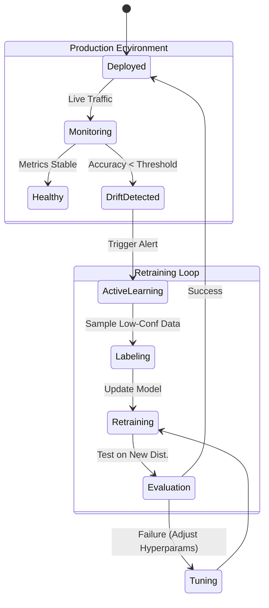

# 8.5 System Design & Coding Scenarios

## Q1: Design a "Toxic Comment Classifier" for a social media platform.


**Answer:**
This is a classic Text Classification problem.

**1. Data Collection & Labeling:**
*   Gather comments.
*   Define "Toxic": Hate speech, harassment, doxxing?
*   Labeling: Use human raters. Ensure class balance (most comments are non-toxic).

**2. Preprocessing:**
*   Clean HTML/URLs.
*   Handle user obfuscation (e.g., "f*ck"). Subword tokenization (BERT) helps here.

**3. Modeling Strategy:**
*   **Baseline:** TF-IDF + Logistic Regression (Fast, interpretable).
*   **Production:** Fine-tuned DistilBERT (Good balance of speed and accuracy).
*   **Multilingual:** Use XLM-RoBERTa if the platform is global.

**4. Metrics:**
*   Optimize for **Recall** on the "Toxic" class (safety first), but monitor **Precision** to avoid censoring innocent users (user frustration). Use **PR-AUC**.

**5. Deployment:**
*   Real-time API. Latency matters.
*   **Post-processing:** Hard rules (allowlist/blocklist).

---

## Q2: How would you build a Search Engine for a company's internal documentation?


**Answer:**
This requires a Retrieval-Augmented Generation (RAG) or Semantic Search approach.

**1. Indexing:**
*   **Chunking:** Split documents into chunks (e.g., 500 words).
*   **Embedding:** Use a model like Sentence-BERT to convert chunks into vectors.
*   **Storage:** Store vectors in a Vector Database (FAISS, Pinecone, Weaviate).

**2. Retrieval (The "Search"):**
*   Convert user query to vector.
*   Perform Approximate Nearest Neighbor (ANN) search to find top-k relevant chunks.
*   **Hybrid Search:** Combine Vector search with Keyword search (BM25) to handle exact phrasing (e.g., error codes).

**3. Ranking:**
*   Re-rank top results using a Cross-Encoder model for higher precision.

**4. Generation (Optional but recommended):**
*   Feed the retrieved text into an LLM (like GPT-4) to synthesize a direct answer.

---

## Q3: Design a system to extract "Skills" from Resumes.


**Answer:**
This is a Named Entity Recognition (NER) problem.

**1. Defining Entities:**
*   Entities: SKILL (Python, SQL), DEGREE (B.Sc), COMPANY.

**2. Data:**
*   Resumes are messy (PDF parsing). Use tools like Apache Tika.
*   Annotation: Label a dataset using tools like Prodigy or Doccano.

**3. Modeling:**
*   **Spacy:** Train a custom NER model.
*   **Gazetteers:** Maintain a list of known skills to boost recall (Match patterns).

**4. Challenges:**
*   **New Skills:** "Prompt Engineering" didn't exist 5 years ago. The system needs continuous retraining.
*   **Context:** "Used Python" vs "Willing to learn Python".

---

## Q4: How would you handle a sudden "Concept Drift" in a News Categorization model?



**Answer:**
Concept Drift occurs when the statistical properties of the target variable change (e.g., a new topic "Covid-19" appears).

**Reasoning & Deep Dive:**
1.  **Monitoring:** Track the distribution of predicted classes and input embeddings. If the input data starts moving far from the training clusters, trigger an alert.
2.  **Uncertainty Sampling:** Identify samples where the model has low confidence (probabilities near 0.5).
3.  **Active Learning:** Send low-confidence samples to human annotators immediately.
4.  **Retraining:** Retrain the model on the fresh data (fine-tuning) or use an online learning approach.

---

## Q5: How do you optimize a Transformer model for low-latency inference on CPU?

**Answer:**
Deploying BERT on a standard CPU is slow. We need optimization.

**Techniques:**
1.  **Distillation:** Use DistilBERT or TinyBERT (smaller student models trained to mimic larger teachers).
2.  **Quantization:** Convert weights from FP32 (32-bit float) to INT8 (8-bit integer). This reduces model size by 4x and speeds up math operations with minimal accuracy loss.
3.  **ONNX Runtime:** Convert the PyTorch model to ONNX format for hardware-optimized execution.
4.  **Sequence Length Reduction:** Don't pad everything to 512. Pad to the longest sequence in the *batch*.

---

## Q6: Write a Python function to calculate Cosine Similarity between two lists of numbers without using sklearn.

**Answer:**

```python
import math

def cosine_similarity(v1, v2):
    if len(v1) != len(v2):
        raise ValueError("Vectors must be same length")
    
    dot_product = sum(a * b for a, b in zip(v1, v2))
    magnitude_v1 = math.sqrt(sum(a * a for a in v1))
    magnitude_v2 = math.sqrt(sum(b * b for b in v2))
    
    if magnitude_v1 == 0 or magnitude_v2 == 0:
        return 0.0 # Handle zero vector case
        
    return dot_product / (magnitude_v1 * magnitude_v2)

# Test
vec_a = [1, 2, 3]
vec_b = [1, 2, 3]
print(cosine_similarity(vec_a, vec_b)) # Should be 1.0
```

---

## Q7: How would you deal with a dataset that has 90% English and 10% French text?

**Answer:**
1.  **Language Identification:** Use a library like `langdetect` or `fasttext` to label the language of each row.
2.  **Strategy A (Filter):** If the goal is an English-only model, drop the French rows.
3.  **Strategy B (Translate):** Use an offline translation model (e.g., MarianMT) to translate French to English (Data Augmentation).
4.  **Strategy C (Multilingual Model):** Use mBERT (Multilingual BERT) or XLM-R which can handle both languages natively.

---

## Q8: Explain the "Recall vs. Latency" trade-off in Vector Search.

**Answer:**
In Vector Databases (like Pinecone/FAISS):
*   **Exact Search (k-NN):** Compares query against *every* vector. Recall = 100%, but Latency is high ($O(N)$).
*   **Approximate Search (ANN):** Uses indices (HNSW, IVF). It narrows down the search space.
    *   **Trade-off:** You might miss the *absolute* best match (lower recall), but you get the result in milliseconds instead of seconds.
    *   **Tuning:** You can tune parameters like `n_probes` or `ef_search`. Higher values check more candidates -> better recall -> higher latency.
